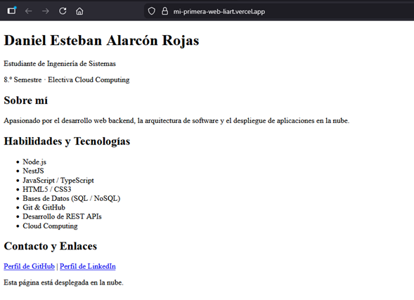

# Hoja de Vida Web - Daniel Esteban Alarcón Rojas

Este repositorio contiene la página web de presentación desarrollada como parte de la asignatura **Electiva Cloud Computing**[span_1](start_span)[span_1](end_span). En ella se detallan mis datos de contacto, nivel académico y conocimientos técnicos.

---

## 🚀 Despliegue en la Nube

La aplicación se encuentra desplegada y accesible públicamente a través de **Vercel** en el siguiente enlace[span_2](start_span)[span_2](end_span):

🔗 **[Ver Sitio Web en Vercel]([https://tu-proyecto.vercel.app](https://mi-primera-web-liart.vercel.app/))** [span_3](start_span)[span_3](end_span)

---

## 📸 Evidencia de Funcionamiento

Captura de pantalla de la página desplegada correctamente desde la nube[span_4](start_span)[span_4](end_span):

---

## 🛠️ Tecnologías y Herramientas

* **Frontend:** HTML5, CSS3
* **Backend & Lenguajes:** Node.js, NestJS, JavaScript, TypeScript
* **Control de Versiones:** Git & GitHub[span_5](start_span)[span_5](end_span)
* **Hosting / Cloud:** Vercel[span_6](start_span)[span_6](end_span)
